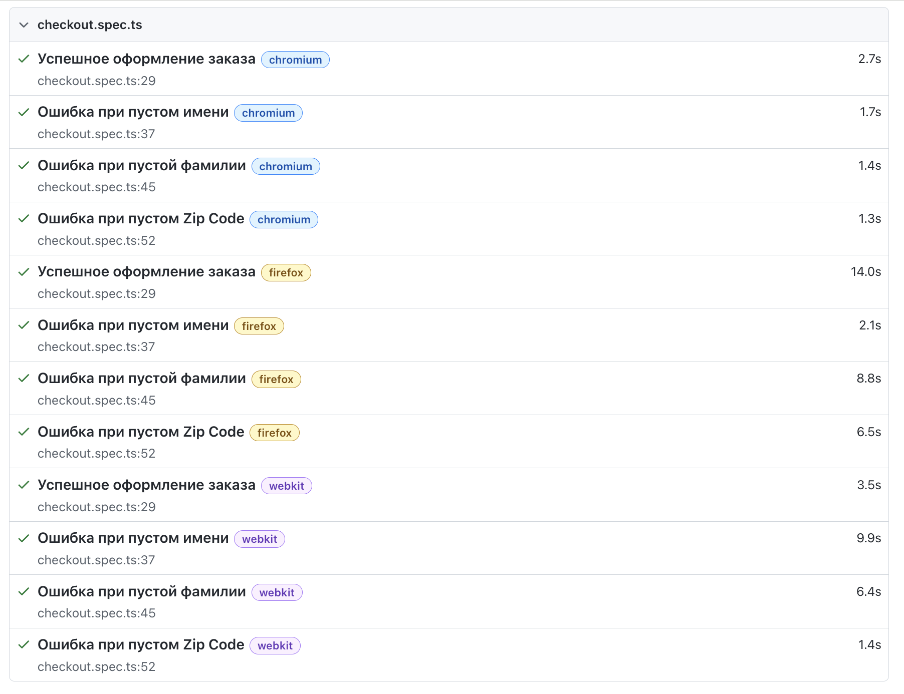

# SauceDemo QA Portfolio

🇷🇺 Русская версия
🇺🇸 English version below

---

## RU

## О проекте

**SauceDemo QA Portfolio** — портфолио-проект по ручному и автоматизированному тестированию интернет-магазина SauceDemo.

Проект демонстрирует практические навыки **Manual QA** и **QA Automation**: тест-дизайн, написание тестовой документации, оформление bug reports, автоматизация UI-тестов, использование Page Object Model, кроссбраузерный запуск и настройка CI/CD через GitHub Actions.

## Объект тестирования

https://www.saucedemo.com/

## Цель проекта

Цель проекта — показать полный QA-подход к тестированию веб-приложения:

* анализ функциональности;
* составление чеклистов;
* разработка тест-кейсов;
* позитивное и негативное тестирование;
* validation testing;
* smoke testing;
* regression testing;
* оформление bug reports;
* автоматизация UI-тестов;
* настройка CI/CD;
* запуск тестов в разных браузерах.

---

## Реализовано

### Manual Testing

В проекте подготовлена тестовая документация:

* smoke checklist;
* login checklist;
* inventory checklist;
* cart checklist;
* checkout checklist;
* regression checklist;
* test cases по функциональным разделам;
* bug reports.

Чеклисты содержат статусы выполнения проверок, комментарии и ID связанных bug reports для найденных дефектов.

В ходе ручного тестирования оформлено **4 bug reports**, связанных с найденными дефектами в Login и Checkout flow.

Тестовая документация разбита по функциональным зонам приложения:

* Login;
* Inventory;
* Cart;
* Checkout.

### Тестовая документация

#### Checklists

* [Smoke Checklist](manual-testing/checklists/smoke-checklist.md)
* [Login Checklist](manual-testing/checklists/login-checklist.md)
* [Inventory Checklist](manual-testing/checklists/inventory-checklist.md)
* [Cart Checklist](manual-testing/checklists/cart-checklist.md)
* [Checkout Checklist](manual-testing/checklists/checkout-checklist.md)
* [Regression Checklist](manual-testing/checklists/regression-checklist.md)

#### Test Cases

* [Login Test Cases](manual-testing/test-cases/login-test-cases.md)
* [Inventory Test Cases](manual-testing/test-cases/inventory-test-cases.md)
* [Cart Test Cases](manual-testing/test-cases/cart-test-cases.md)
* [Checkout Test Cases](manual-testing/test-cases/checkout-test-cases.md)

#### Bug Reports

* [Bug Reports](manual-testing/bug-reports/)

### Automation Testing

Автоматизированные UI-тесты реализованы на **Playwright + TypeScript** с использованием паттерна **Page Object Model**.

Автотесты покрывают основные пользовательские сценарии интернет-магазина:

* успешная авторизация;
* негативные проверки формы логина;
* проверка заблокированного пользователя;
* проверка отображения списка товаров;
* проверка сортировки товаров;
* добавление товаров в корзину;
* удаление товаров из корзины;
* проверка счетчика корзины;
* проверка содержимого корзины;
* переход к checkout;
* валидация checkout-формы;
* проверка checkout overview;
* завершение покупки.

---

## Покрытие автотестами

| Раздел    | Количество тестов |
| --------- | ----------------: |
| Login     |                 8 |
| Inventory |                 9 |
| Cart      |                 6 |
| Checkout  |                 7 |
| **Всего** |            **30** |

---

## CI/CD

В проекте настроен автоматический запуск автотестов с помощью **GitHub Actions**.

Тесты запускаются автоматически при каждом:

* `push` в ветку `main` или `master`;
* создании или обновлении `pull request` в ветку `main` или `master`.

CI-пайплайн выполняет следующие шаги:

* скачивает репозиторий;
* устанавливает Node.js;
* устанавливает зависимости проекта;
* устанавливает браузеры Playwright;
* запускает автоматизированные UI-тесты;
* сохраняет Playwright HTML Report как artifact.

---

## Test Reports

В проекте настроены два вида отчетов:

- **Playwright HTML Report** — стандартный отчет Playwright для анализа результатов тестов;
- **Allure Report** — расширенный отчет с более удобной структурой test suites, статусов и деталей выполнения.

После запуска тестов в GitHub Actions отчеты сохраняются как artifacts:

- `playwright-report`;
- `allure-report`;
- `allure-results`.

Это позволяет анализировать результаты автотестов после каждого CI-запуска.

---

## Поддерживаемые браузеры

Автотесты могут запускаться в нескольких браузерах:

* Chromium;
* Firefox;
* WebKit.

Для быстрой локальной разработки используется запуск в Chromium. Полный кроссбраузерный прогон можно использовать перед push или в CI.

---

## Структура проекта

```text
qa-saucedemo-portfolio/

├── manual-testing/
│   ├── bug-reports/
│   ├── checklists/
│   │   ├── smoke-checklist.md
│   │   ├── login-checklist.md
│   │   ├── inventory-checklist.md
│   │   ├── cart-checklist.md
│   │   ├── checkout-checklist.md
│   │   └── regression-checklist.md
│   │
│   └── test-cases/
│       ├── login-test-cases.md
│       ├── inventory-test-cases.md
│       ├── cart-test-cases.md
│       └── checkout-test-cases.md
│
├── playwright/
│   ├── fixtures/
│   ├── pages/
│   ├── tests/
│   ├── screenshots/
│   ├── playwright.config.ts
│   ├── package.json
│   └── tsconfig.json
│
├── .github/
│   └── workflows/
│       └── playwright.yml
│
└── README.md
```

---

## Установка и запуск

Перейти в папку с автотестами:

```bash
cd playwright
```

Установить зависимости:

```bash
npm install
```

Запустить все тесты:

```bash
npm run test
```

Запустить все тесты только в Chromium:

```bash
npm run test:chromium
```

Запустить только Login-тесты:

```bash
npm run test:login
```

Запустить только Inventory-тесты:

```bash
npm run test:inventory
```

Запустить только Cart-тесты:

```bash
npm run test:cart
```

Запустить только Checkout-тесты:

```bash
npm run test:checkout
```

Запустить тесты в headed-режиме:

```bash
npm run test:headed
```

Открыть Playwright UI mode:

```bash
npm run test:ui
```

Открыть HTML-отчет:

```bash
npm run report
```

---

## Playwright Report

Пример HTML-отчета Playwright:



---

## Используемые технологии

* Playwright;
* TypeScript;
* Node.js;
* Git;
* GitHub;
* GitHub Actions;
* Page Object Model;
* HTML Report.

---

## Приобретённые и продемонстрированные навыки

### Manual QA

* составление чеклистов;
* написание тест-кейсов;
* smoke testing;
* functional testing;
* regression testing;
* validation testing;
* negative testing;
* оформление bug reports;
* тест-дизайн;
* анализ пользовательских сценариев.

### Automation QA

* UI automation;
* Playwright;
* TypeScript;
* Page Object Model;
* работа с локаторами;
* assertions;
* fixtures;
* test data;
* кроссбраузерное тестирование;
* настройка npm scripts;
* настройка GitHub Actions;
* анализ HTML-отчета.

---

## Дальнейшее развитие проекта

Планируемые улучшения:

* подключить Allure Report;
* добавить API-тесты на Playwright;
* добавить Docker;
* добавить примеры Trace Viewer;
* расширить набор bug reports при дальнейшем exploratory testing;
* добавить больше негативных и edge-case сценариев;
* улучшить README с примерами отчетов и скриншотов.

---

## EN

## About the Project

**SauceDemo QA Portfolio** is a QA portfolio project focused on manual and automated testing of the SauceDemo e-commerce web application.

The project demonstrates practical **Manual QA** and **QA Automation** skills: test design, test documentation, bug reporting, UI test automation, Page Object Model, cross-browser testing, and CI/CD setup with GitHub Actions.

## Application Under Test

https://www.saucedemo.com/

## Project Goal

The goal of this project is to demonstrate a complete QA approach to testing a web application:

* functionality analysis;
* checklist creation;
* test case design;
* positive and negative testing;
* validation testing;
* smoke testing;
* regression testing;
* bug reporting;
* UI test automation;
* CI/CD setup;
* cross-browser test execution.

---

## Implemented

### Manual Testing

The project includes manual testing documentation:

* smoke checklist;
* login checklist;
* inventory checklist;
* cart checklist;
* checkout checklist;
* regression checklist;
* test cases by functional area;
* bug reports.

Manual checklists include execution status, comments, and related bug report IDs where defects were found.

Manual testing resulted in **4 bug reports** related to defects found in the Login and Checkout flows.

The documentation is organized by the main functional areas of the application:

* Login;
* Inventory;
* Cart;
* Checkout.

### Test Documentation

#### Checklists

* [Smoke Checklist](manual-testing/checklists/smoke-checklist.md)
* [Login Checklist](manual-testing/checklists/login-checklist.md)
* [Inventory Checklist](manual-testing/checklists/inventory-checklist.md)
* [Cart Checklist](manual-testing/checklists/cart-checklist.md)
* [Checkout Checklist](manual-testing/checklists/checkout-checklist.md)
* [Regression Checklist](manual-testing/checklists/regression-checklist.md)

#### Test Cases

* [Login Test Cases](manual-testing/test-cases/login-test-cases.md)
* [Inventory Test Cases](manual-testing/test-cases/inventory-test-cases.md)
* [Cart Test Cases](manual-testing/test-cases/cart-test-cases.md)
* [Checkout Test Cases](manual-testing/test-cases/checkout-test-cases.md)

#### Bug Reports

* [Bug Reports](manual-testing/bug-reports/)

### Automation Testing

Automated UI tests are implemented with **Playwright + TypeScript** using the **Page Object Model** pattern.

The automated tests cover the main user scenarios of the e-commerce application:

* successful login;
* negative login validation;
* locked user login restriction;
* product list display;
* product sorting;
* adding products to the cart;
* removing products from the cart;
* cart badge validation;
* cart content validation;
* checkout navigation;
* checkout form validation;
* checkout overview validation;
* order completion.

---

## Automated Test Coverage

| Area      | Number of Tests |
| --------- | --------------: |
| Login     |               8 |
| Inventory |               9 |
| Cart      |               6 |
| Checkout  |               7 |
| **Total** |          **30** |

---

## CI/CD

The project uses **GitHub Actions** to run automated UI tests.

The tests are triggered automatically on:

* `push` to the `main` or `master` branch;
* creating or updating a `pull request` to the `main` or `master` branch.

The CI pipeline performs the following steps:

* checks out the repository;
* sets up Node.js;
* installs project dependencies;
* installs Playwright browsers;
* runs automated UI tests;
* uploads the Playwright HTML Report as an artifact.

---

## Test Reports

The project uses two types of test reports:

- **Playwright HTML Report** — the default Playwright report for test result analysis;
- **Allure Report** — an extended report with structured test suites, statuses, and execution details.

After each GitHub Actions run, the reports are saved as artifacts:

- `playwright-report`;
- `allure-report`;
- `allure-results`.

This allows test results to be analyzed after every CI execution.

---

## Supported Browsers

The automated tests can be executed in multiple browsers:

* Chromium;
* Firefox;
* WebKit.

Chromium is used for fast local development. Full cross-browser execution can be used before push or in CI.

---

## Project Structure

```text
qa-saucedemo-portfolio/

├── manual-testing/
│   ├── bug-reports/
│   ├── checklists/
│   │   ├── smoke-checklist.md
│   │   ├── login-checklist.md
│   │   ├── inventory-checklist.md
│   │   ├── cart-checklist.md
│   │   ├── checkout-checklist.md
│   │   └── regression-checklist.md
│   │
│   └── test-cases/
│       ├── login-test-cases.md
│       ├── inventory-test-cases.md
│       ├── cart-test-cases.md
│       └── checkout-test-cases.md
│
├── playwright/
│   ├── fixtures/
│   ├── pages/
│   ├── tests/
│   ├── screenshots/
│   ├── playwright.config.ts
│   ├── package.json
│   └── tsconfig.json
│
├── .github/
│   └── workflows/
│       └── playwright.yml
│
└── README.md
```

---

## Installation and Running Tests

Go to the Playwright project folder:

```bash
cd playwright
```

Install dependencies:

```bash
npm install
```

Run all tests:

```bash
npm run test
```

Run all tests in Chromium only:

```bash
npm run test:chromium
```

Run Login tests only:

```bash
npm run test:login
```

Run Inventory tests only:

```bash
npm run test:inventory
```

Run Cart tests only:

```bash
npm run test:cart
```

Run Checkout tests only:

```bash
npm run test:checkout
```

Run tests in headed mode:

```bash
npm run test:headed
```

Open Playwright UI mode:

```bash
npm run test:ui
```

Open HTML report:

```bash
npm run report
```

---

## Playwright Report

Example of a Playwright HTML report:


---

## Tech Stack

* Playwright;
* TypeScript;
* Node.js;
* Git;
* GitHub;
* GitHub Actions;
* Page Object Model;
* HTML Report.

---

## Skills Demonstrated

### Manual QA

* checklist creation;
* test case writing;
* smoke testing;
* functional testing;
* regression testing;
* validation testing;
* negative testing;
* bug reporting;
* test design;
* user flow analysis.

### Automation QA

* UI automation;
* Playwright;
* TypeScript;
* Page Object Model;
* locators;
* assertions;
* fixtures;
* test data;
* cross-browser testing;
* npm scripts setup;
* GitHub Actions setup;
* HTML report analysis.

---

## Roadmap

Planned improvements:

* add Allure Report;
* add API tests with Playwright;
* add Docker;
* add Trace Viewer examples;
* expand bug reports during further exploratory testing;
* add more negative and edge-case scenarios;
* improve README with report examples and screenshots.
